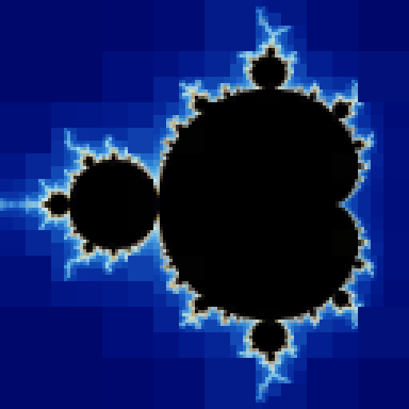

# Quadtree Based Image Segmentation

This project was created in order to create a paper about discrete mathematics. I, as the author of the paper, sincerely hope that this paper may be useful for whatever reason you may use.

This image segmentation was made in order to test a quadtree based compression

## Acknowledgement

Thank you for GitHub user `fogleman` for inspiring me to make this quadree based segmentation. The link to his repository can be found [here](https://github.com/fogleman/Quads).

## Examples

Image Name| STD | Depth Limit | Image |
----------|-----|-------------|-------|
Lenna     |10.0 |      8      ||
Lenna     |7.0  |      8      ||
Mandelbrot|20.0 |      7      ||